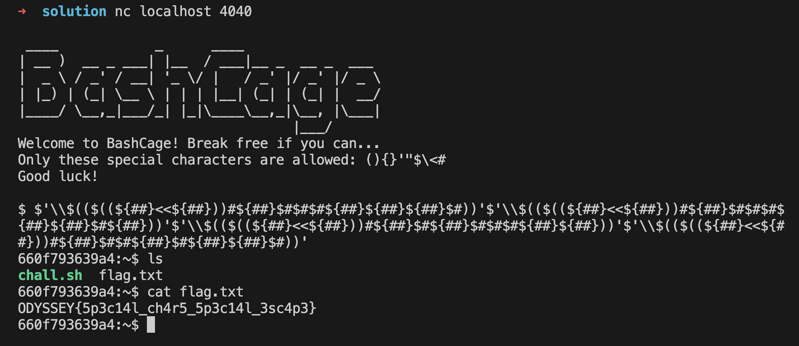

# [**Writeup**](#)

## Understanding the Allowed Characters

The allowed characters in the BashCage environment are `(){}'\"$\\<#`. These characters can be utilized to build commands, but the challenge lies in the fact that many common characters are forbidden. This limitation necessitates creative use of the allowed characters to perform operations and manipulate data.

## Key Techniques for Command Construction

1. **Argument Count and Length**:
   - The special variable `$#` represents the number of arguments passed to a script or function. In this case, it evaluates to `0` since no arguments are provided initially.
   - The variable `${##}` is a count variable that evaluates to the length of the string `#`, which is `1`.

2. **Arithmetic Expressions**:
   - The `$((expr))` syntax allows for arithmetic operations. This can be leveraged to perform calculations or manipulate numbers within the constraints of the allowed characters.
   - For example, `$((1<<1))` performs a left shift operation on the value `1`, effectively doubling it to `2`. This operation can be used to generate values that can be further manipulated or used in commands.

3. **Character Conversion**:
   - The syntax `$'\123'` allows for the conversion of octal values to their corresponding characters in string literals. This can be particularly useful for generating characters that are otherwise restricted.

4. **Binary to Decimal Conversion**:
   - The expression `$((2#1000101))` converts a binary number to its decimal equivalent. However, since the digits `2`, `1`, and `0` are forbidden, they must be replaced with allowed characters or expressions that yield the same result.

## Building Commands to Escape the Jail

By combining these techniques, we can construct commands that effectively bypass the restrictions of this challenge. For instance, using the allowed characters to create expressions that evaluate to forbidden numbers or characters can lead to the execution of arbitrary commands.

To illustrate this process, let's break down the construction of a command to execute `sh` using the allowed characters:

1. **Constructing Commands Using Octal Values**:
    ```bash
    $'\163'$'\150'
    ```
    This command evaluates to `sh`. Here, `163` is the octal value for `s`, and `150` is the octal value for `h`.

2. **Utilizing Binary Values for Command Construction**:
    ```bash
    $((2#10100011))
    $((2#10010110))
    ```
    These commands evaluate to `163` and `150`, representing the binary equivalents of the octal values for `s` and `h`.

3. **Transforming Binary to Octal Representation**:
    ```bash
    $'\\$((2#10100011))'$'\\$((2#10010110))'
    ```
    In this step, we replace the octal digits with their binary representations. The double backslash is used to escape the backslash character due to the double evaluation of the command done by the `printf`.

4. **Removing Forbidden Digits from Binary**:
    ```bash
    $'\\$(($((1<<1))#10100011))'$'\\$(($((1<<1))#10010110))'
    ```
    Here, we eliminate the digit `2` from the binary representation, substituting it with `$((1<<1))`, which evaluates to `2`.

5. **Final Command Construction with Allowed Characters**:
    ```bash
    $'\\$(($((${##}<<${##}))#${##}$#${##}$#$#$#${##}${##}))'$'\\$(($((${##}<<${##}))#${##}$#$#${##}$#${##}${##}$#))'
    ```
    This step further refines the command by replacing the binary digits `0` and `1` with their respective representations using allowed characters. The `$#` variable represents the digit `0`, while `${##}` represents the digit `1`.

We can now use this command to escape the jail and execute `sh` and retrieve the flag.



# [**Solution**](#)
See the [solve.py](./solve.py) for the full implementation.
