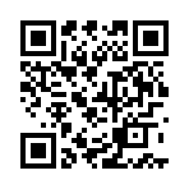

# [**QRupted Code**](#)

## Description:
* A critical message is hidden in this corrupted QR code, but it’s unreadable in its current form. Can you recover the flag from the chaos?

## Difficulty:
* Medium

## Objective:
The objective of this challenge is to recover the corrupted QR Code and retrieve the flag.

## Challenge:


## Solution:
This challenge focuses on understanding how QR Codes are built. The solution consists of two steps.

The first step is to fix the placement of the alignment block, which was displaced to the bottom right by one block:



In the second step, notice that the QR Code has large blocks of the same color, which makes it seem like the mask is not applied. We then need to get the mask pattern from the format information. You can use the [QRazyBox](https://merri.cx/qrazybox/) website to retrieve information about the QR Code.


Now let's apply the Mask Pattern to the QR Code. You can use the same website to do that.


After applying the Mask Pattern, we get this QR Code:


We decode the QR Code and obtain the flag:


## Flag:
```
ODYSSEY{1_Sh4ll_C4ll_Y0u_QR_G0d}
```